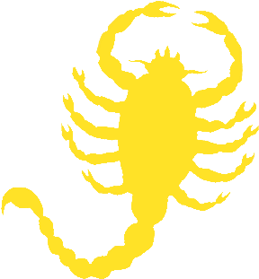

<div align="center">
  

# ScorpionSatin Engine

A modular Vulkan game engine for MMO-style games, featuring ECS architecture, real-time ray-traced global illumination, and networked multiplayer support.
</div>

## Features

- **Vulkan 1.4** - Modern low-level rendering with vk-bootstrap and VMA
- **ECS Framework** - Flecs for entity-component-system architecture
- **Networking** - MsQuic (QUIC) for low-latency multiplayer
- **Global Illumination** - RTXGI (NRC/SHaRC) for ray-traced GI
- **Navigation** - Recast/Detour for NavMesh pathfinding and collision
- **Editor** - ImGui-based viewport, entity inspector, NavMesh visualization
- **Cross-Platform** - Windows (client), Linux (headless server)

## Prerequisites

### All Platforms
- **CMake 3.25+**
- **Git** with submodule support
- **C++23** toolchain

### Windows (Client Build)
- **Visual Studio 2022** with C++ build tools
- **Vulkan SDK** ([LunarG](https://vulkan.lunarg.com/sdk/home)) - required for Editor/Game builds

### Linux (Headless Server)
- **GCC 11+** or **Clang 14+**

## Quick Start

### 1. Clone and Initialize Submodules
```bash
git clone <your-repo-url> ScorpionSatin
cd ScorpionSatin
git submodule update --init --recursive
```

### 2. Build

**Headless (Dedicated Server) - no Vulkan required:**
```bash
mkdir build
cd build
cmake .. -DENGINE_HEADLESS=ON
cmake --build . --config Debug
```

**Client (Editor + Game) - requires Vulkan SDK:**
```bash
mkdir build
cd build
cmake .. -DENGINE_HEADLESS=OFF -DENGINE_EDITOR=ON
cmake --build . --config Debug
```

### 3. Run

**Dedicated Server (headless):**
```bash
# Windows
.\build\Debug\DedicatedServer.exe --headless

# Linux
./build/DedicatedServer --headless
```

**Editor (client, when Vulkan SDK is installed):**
```bash
# Windows
.\build\Debug\Editor.exe

# Linux
./build/Editor
```

## Build Options

| Option | Default | Description |
|--------|---------|-------------|
| `ENGINE_HEADLESS` | OFF | Build headless server only (no Vulkan/ImGui/GLFW) |
| `ENGINE_EDITOR` | ON | Include ImGui editor panels (client only) |
| `ENGINE_RTXGI` | ON | Enable RTXGI global illumination (client only) |

## Build Outputs

| Target | Output | When |
|--------|--------|------|
| Engine | `Engine.dll` (Win) / `Engine.so` (Linux) | Always |
| DedicatedServer | `DedicatedServer.exe` | `ENGINE_HEADLESS=ON` |
| Editor | `Editor.exe` | Client + `ENGINE_EDITOR=ON` |
| Game | `Game.dll` | Client build |

Outputs are in `build/Debug/` or `build/Release/` depending on config.

## Project Structure

```
ScorpionSatin/
├── src/
│   ├── core/       # Entry point, windowing (GLFW), main loop
│   ├── render/     # Vulkan wrappers, RTXGI integration
│   ├── ecs/        # Flecs components and systems
│   ├── collision/  # Spatial Grid, sphere/AABB checks
│   ├── editor/     # ImGui panels, viewport, entity inspector
│   ├── network/    # MsQuic client/server
│   └── navmesh/    # Recast/Detour integration
├── shaders/        # GLSL source (compiled to SPIR-V)
├── include/        # Public API (EngineCore.h, Renderer.h)
├── libs/           # Git submodules
│   ├── flecs/      # ECS framework
│   ├── msquic/     # Network library
│   ├── rtxgi/      # RTXGI (NRC/SHaRC)
│   ├── recastnavigation/  # NavMesh
│   ├── VulkanMemoryAllocator/
│   ├── vk-bootstrap/
│   ├── imgui/
│   └── glfw/
└── docs/           # Architecture documentation
```

## Cursor IDE

The project includes `.vscode/` configuration:

- **CMake Tools** - Configure on open, build directory
- **Tasks** - `CMake Configure (Client)`, `CMake Configure (Headless)`, `CMake Build`
- **Launch** - Debug `Editor.exe` or `DedicatedServer.exe`

Use **Run and Debug** (F5) or the build task to compile.

## Troubleshooting

### Vulkan not found
**Symptom:** `Could NOT find Vulkan` during CMake configure.

**Solution:** Install the [Vulkan SDK](https://vulkan.lunarg.com/sdk/home) and ensure it's on PATH. Or build headless: `cmake -DENGINE_HEADLESS=ON ..` or add `-DVulkan_ROOT="C:/VulkanSDK/1.4.341.1"`

### Submodules not initialized
**Symptom:** `Cannot find msquic`, `flecs`, etc.

**Solution:**
```bash
git submodule update --init --recursive
```

### Clean rebuild
```bash
rm -rf build
mkdir build && cd build
cmake .. -DENGINE_HEADLESS=ON   # or OFF for client
cmake --build . --config Debug
```

## Documentation

- [Engine Architecture](docs/engine-architecture.md)
- [Renderer](docs/architecture/renderer.md)
- [ECS](docs/architecture/ecs.md)
- [Networking](docs/architecture/networking.md)
- [Server / Headless](docs/architecture/server-headless.md)
- [Build & Hot-Reload](docs/architecture/build-and-hotreload.md)

## License

See `LICENSE` file for details.

## Credits

- [Flecs](https://github.com/SanderMertens/flecs) - ECS framework
- [MsQuic](https://github.com/microsoft/msquic) - QUIC networking
- [RTXGI](https://github.com/NVIDIA-RTX/RTXGI) - Ray-traced global illumination
- [Recast/Detour](https://github.com/recastnavigation/recastnavigation) - NavMesh
- [VulkanMemoryAllocator](https://github.com/GPUOpen-LibrariesAndSDKs/VulkanMemoryAllocator)
- [vk-bootstrap](https://github.com/charles-lunarg/vk-bootstrap)
- [ImGui](https://github.com/ocornut/imgui)
- [GLFW](https://github.com/glfw/glfw)
